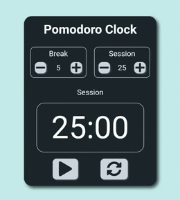
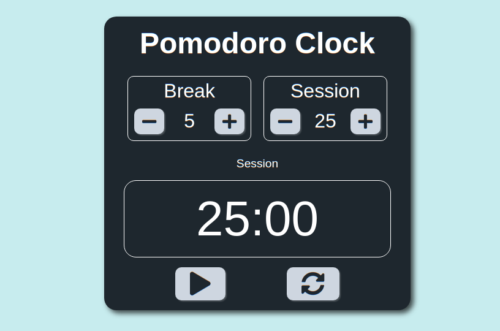

# Pomodoro Clock

> A pomodoro clock app to make you more productive.
> hosted project: https://vshalt.github.io/pomodoro-clock

---

## Table of Contents
- [Description](#description)
- [Technologies](#technologies)
- [How To Use](#how-to-use)
- [Installation](#installation)
- [License](#license)

---

## Description
- This is a simple but effective way to monitor your productivity.
- You work when the session is active, there are breaks after every session.
- The session is originally 25 minutes long and the breaks 5 minutes.
- The user can play around with the session and break time.
- The page is responsive, configured for mobile view too.
- At the end of every session/break there is a audio response for the user to know the timer has ended.

---

### Technologies
- React
- JavaScript
- HTML
- CSS

---

## How To Use
You can view the hosted project [here](https://vshalt.github.io/pomodoro-clock) or https://vshalt.github.io/pomodoro-clock

---

## Installation
- Clone the repository with `git clone https://github.com/vshalt/pomodoro-clock`
- Then change directory into the newly cloned repository.
- Run `npm install` to install the dependencies
- Once the dependencies are installed run the project locally with `npm start`
- Happy productivity!

---

## License
MIT License
[Read here](./LICENSE)

[Back To The Top](#pomodoro-clock)
